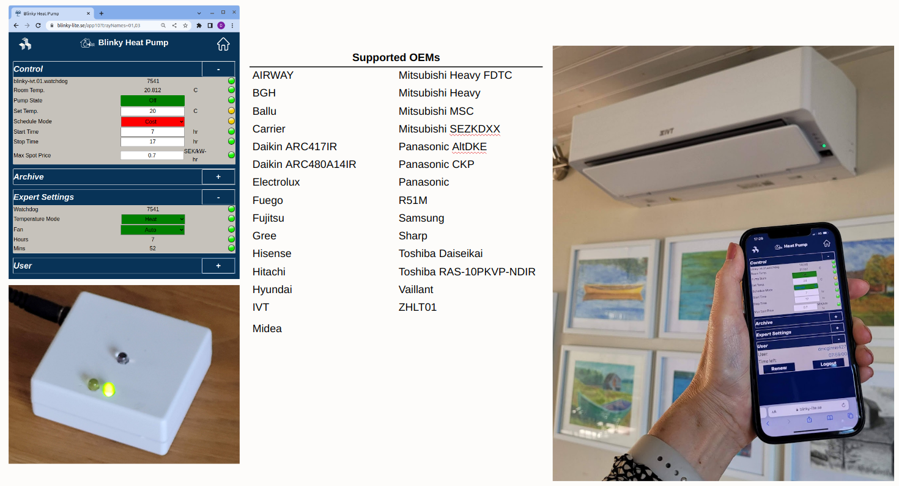

# Blinky IVT Tray
Just like many heat pumps, the IVT Heat pump web interface API is closed so it is not possible to interface a spot price device directly to this heat pump. In additon many older but perfectly functioning heat pumps do not even have an internet interface. Replacing the  heat pump just because the heat pump cannot connect to the internet would be very wasteful.

However, as with most heat pumps, this heat pump is controlled with a infra-red remote control. As a workaround, the an infra-red remote control can be substituted with an [Blinky IVT Cube](https://github.com/blinky-lite-energy-exchange/blinky-ivt-cube) that is equipped with a an infra-red diode that can send the appropriate pulse sequence to the heat pump. A list of different pulse sequences can be found at [ToniA/arduino-heatpumpir](https://github.com/ToniA/arduino-heatpumpir). The [ToniA/arduino-heatpumpir](https://github.com/ToniA/arduino-heatpumpir) project contains pulse sequences for 29 different models of heat pumps so it possible to easily extend the Blinky IVT Cube to many different models of heat pumps. The Blinky IVT cube can be remotely controlled via a Blinky-IVT tray which has access to the electric spot price and can talk and be controlled with an web app on the Blinky-Lite application box.

This tray receives user input and the spot price from the Blinky-Lite application box server and uses the Blinky-Bus interface to communicate serially with the cube.The serial communication in this tray is done over Bluetooth. The tray code is derived from the [Blinky-Bus tray](https://github.com/Blinky-Lite-Exchange/blinky-bus-tray) project

 
